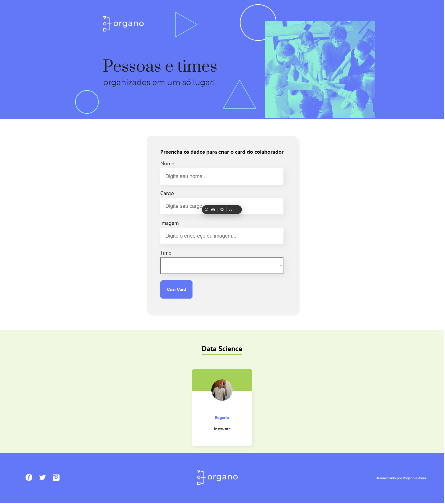

# Introdução ao Create React App

Este projeto foi iniciado com [Create React App](https://github.com/facebook/create-react-app).

## Deploy no Vercel

O projeto está disponível online no Vercel:

## Scripts Disponíveis

No diretório do projeto, você pode executar:

### `npm run start`

Inicia o aplicativo no modo de desenvolvimento.  
Abra [http://localhost:3000](http://localhost:3000) para visualizá-lo no navegador.

## Captura de Tela do Site

Aqui você pode incluir uma captura de tela do seu site desenvolvido com React:

